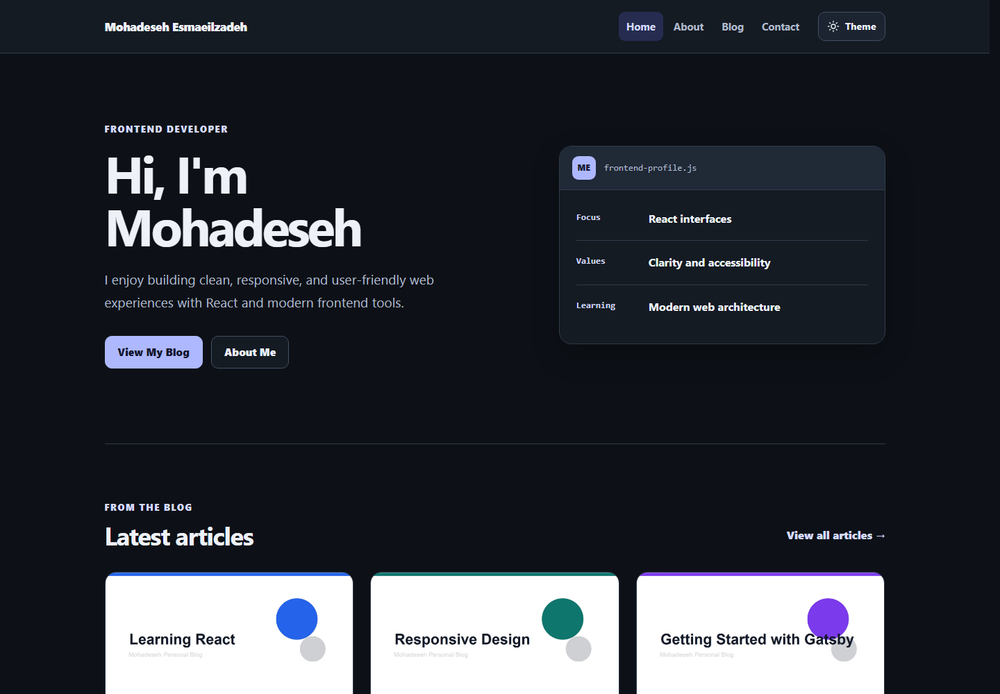
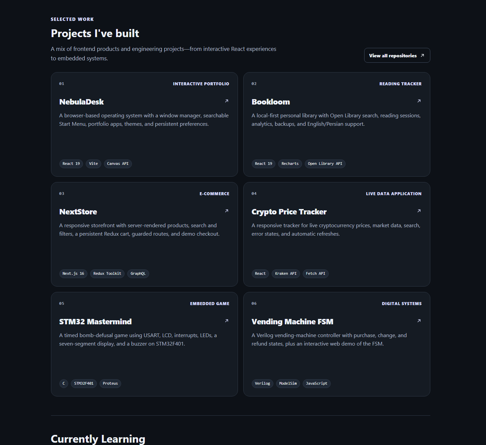
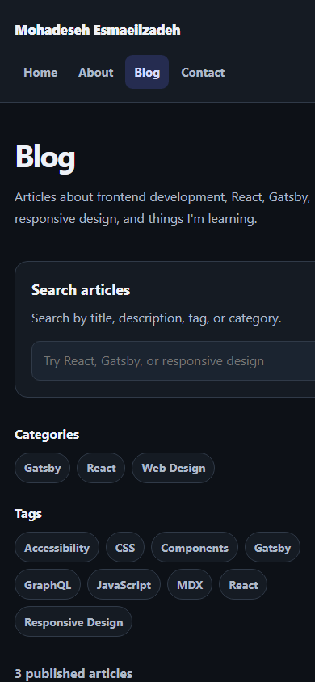

<div align="center">

# Mohadeseh's Frontend Blog

**A fast, accessible personal blog for sharing frontend notes, projects, and practical lessons.**

[](https://www.gatsbyjs.com/)
[](https://react.dev/)
[](https://mdxjs.com/)
[](#quality-checks)
[](#built-with-care)

[Explore the code](https://github.com/mohadesehesmaeilzadeh/gatsby-personal-blog) · [Meet the developer](#about-the-developer)

</div>



## About the project

This is my personal corner of the web: part frontend blog, part project showcase, and part learning journal. It is built with Gatsby and React, with every article stored as portable MDX content rather than inside a CMS.

The project started as a Gatsby starter and grew into a complete, developer-focused publishing experience with taxonomy archives, lightweight search, related content, theme persistence, social metadata, RSS, and accessible responsive layouts.

## Highlights

| Area | What is included |
| --- | --- |
| Writing | MDX posts with typed frontmatter, cover images, drafts, categories, and tags |
| Discovery | Client-side search across titles, descriptions, tags, and categories |
| Navigation | Tag/category archives, previous and next posts, and related articles |
| Presentation | Responsive layouts, optimized Gatsby images, article typography, and code styles |
| Theme | Persistent light/dark preference with `prefers-color-scheme` fallback |
| Publishing | Canonical URLs, Open Graph, Twitter/X cards, sitemap, and RSS feed |
| Accessibility | Semantic landmarks, visible focus, labeled controls, reduced motion, and keyboard support |
| Quality | Focused tests for search, archives, navigation, related posts, theme, and SEO helpers |

## Selected work

The About page brings frontend and engineering work together in one responsive project grid.



## Responsive by default

Search, topic navigation, article cards, and empty states are designed to remain useful on smaller screens—not simply shrink to fit.

<p align="center">
  
</p>

## Tech stack

- **Framework:** Gatsby 5
- **UI:** React 18 and CSS Modules
- **Content:** MDX and Gatsby's GraphQL data layer
- **Images:** `gatsby-plugin-image` and Sharp
- **Publishing:** Gatsby Sitemap and Feed plugins
- **Testing:** Node.js built-in test runner

## Project structure

```text
gatsby-personal-blog/
├── content/blog/              # One folder per MDX article
├── docs/screenshots/          # README previews
├── src/
│   ├── components/            # Layout, cards, SEO, and theme controls
│   ├── pages/                 # Home, About, Blog, Contact, and 404
│   ├── styles/                # Global design tokens and article defaults
│   ├── templates/             # Post and taxonomy archive pages
│   └── utils/                 # Search, navigation, theme, and SEO logic
├── tests/                     # Focused behavior tests
├── gatsby-config.js           # Metadata, sources, sitemap, and RSS
└── gatsby-node.js             # Schema and dynamic page creation
```

## Getting started

### Prerequisites

- Node.js `>=18 <26`
- npm

### Install and run

```bash
git clone https://github.com/mohadesehesmaeilzadeh/gatsby-personal-blog.git
cd gatsby-personal-blog
npm install
npm run develop
```

Open [http://localhost:8000](http://localhost:8000).

## Available scripts

| Command | Purpose |
| --- | --- |
| `npm run develop` | Start Gatsby in development mode |
| `npm test` | Run the focused behavior test suite |
| `npm run build` | Create the production build |
| `npm run serve` | Preview the production build locally |
| `npm run clean` | Clear Gatsby caches and generated output |

## Writing a post

Create a folder inside `content/blog` with an `index.mdx` file and an optional local cover image:

```text
content/blog/my-new-post/
├── cover.jpg
└── index.mdx
```

Use the standardized frontmatter schema:

```yaml
---
title: "My new article"
slug: "/blog/my-new-article/"
date: "2026-09-26"
description: "A concise description used by cards, feeds, and social metadata."
tags:
  - React
  - Accessibility
category: "Frontend"
cover: "./cover.jpg"
published: true
---
```

Set `published: false` to keep a draft out of generated pages, archives, search results, the sitemap, and RSS.

## Content flow

```text
MDX + frontmatter
        ↓
Gatsby GraphQL data layer
        ↓
Post pages ── Search ── Tag/category archives
        ↓
SEO metadata ── Sitemap ── RSS
```

## Built with care

- Covers are processed through Gatsby Image with responsive AVIF/WebP output.
- Theme selection is stored locally and falls back to the operating-system preference.
- Interactive controls retain visible keyboard focus in both themes.
- Motion is reduced when `prefers-reduced-motion` is enabled.
- Missing optional post metadata falls back safely instead of breaking builds.
- Core behavior is extracted into small pure helpers so it can be tested without testing Gatsby internals.

## Quality checks

```bash
npm test
npm run build
```

The current suite covers:

- search matches and no-results state
- tag and category grouping
- previous/next navigation
- related-post ranking and exclusions
- stored and system theme preferences
- SEO title, description, canonical, and image fallbacks

## Deployment

The generated `public` directory can be deployed to Netlify, Cloudflare Pages, or another static host.

Recommended Netlify settings:

```text
Build command:     npm run build
Publish directory: public
```

Set `SITE_URL` to the production origin so canonical URLs, sitemap entries, RSS links, and social metadata use the correct domain.

## About the developer

Built by **Mohadeseh Esmaeilzadeh**, a frontend developer who enjoys turning ideas into clear, responsive, and accessible interfaces.

[GitHub](https://github.com/mohadesehesmaeilzadeh) · [LinkedIn](https://www.linkedin.com/in/mohadeseh-esmaeilzadeh-1102303b2) · [X](https://x.com/Mohi7121) · [Telegram](https://t.me/simply_mohitow)

<div align="center">

If this project helps or inspires you, a star is always appreciated.

</div>
